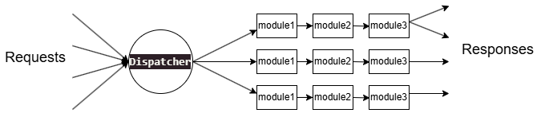

# ImageServer


## Overview
The ImageServer is composed of the following components:

1. ​**​Dispatcher​**​: Handles client requests, dispatches tasks, and sends responses.
2. ​**​Volume​**​: Manages image persistence and storage.
3. ​**​Pipeline​**​: Defines image processing workflows.
4. ​**​Handlers​**​: Manages interactions between pipeline modules and volumes.
5. ​**​Database​**​: Stores and manages key-value pairs.

## Dispatcher
The Dispatcher serves as the main entry point for the ImageServer. It:
- Receives and initializes client requests
- Distributes tasks to appropriate pipelines
- Composes and sends responses after processing

## Volume
The server utilizes three types of volumes for image persistence and management:

1. ​**​Persistent Volume (pVol)​**​: Disk-based storage
2. ​**​Ephemeral Volume (eVol)​**​: Disk-based storage with fixed-size resources and volume-managed lifecycle
3. ​**​Memory Volume (mVol)​**​: RAM-based storage with behavior similar to ephemeral volume, but faster

## Pipeline
Pipelines define image processing workflows and consist of multiple connected modules. Every pipeline must contain:

- ​**​Head Module​**​: Receives requests and initializes connections
- ​**​Tail Module​**​: Returns processed responses

Intermediate modules perform specific tasks (e.g., watermarking, WebP compression).

### Module Specification
Each module must define:
- Input (ImageMeta)
- Output (ImageMeta)
- Configuration parameters

## Handlers
Handlers manage interactions between modules and volumes. Examples include:
- `GetImgMeta(const char *request)`: Retrieves image metadata from client requests
- `pVolImgWrite(ImageMeta *src)`: Writes images to persistent storage

## Database
The system employs a dual-layer database architecture:
- ​**​mDatabase​**​: Memory-based key-value store
- ​**​pDatabase​**​: Persistent SQLite3-based storage

The database manages:
- Image metadata
- System configurations
- Module caching

## Developer Log

### ImageMeta Structure
```c
#define AddrTypePVol 0
#define AddrTypeEVol 1
#define AddrTypeMVol 2

typedef char AddrType;

typedef struct ImageMeta {
    AddrType addrType;
    char *imgAddr;
    char *ext;
} ImageMeta;